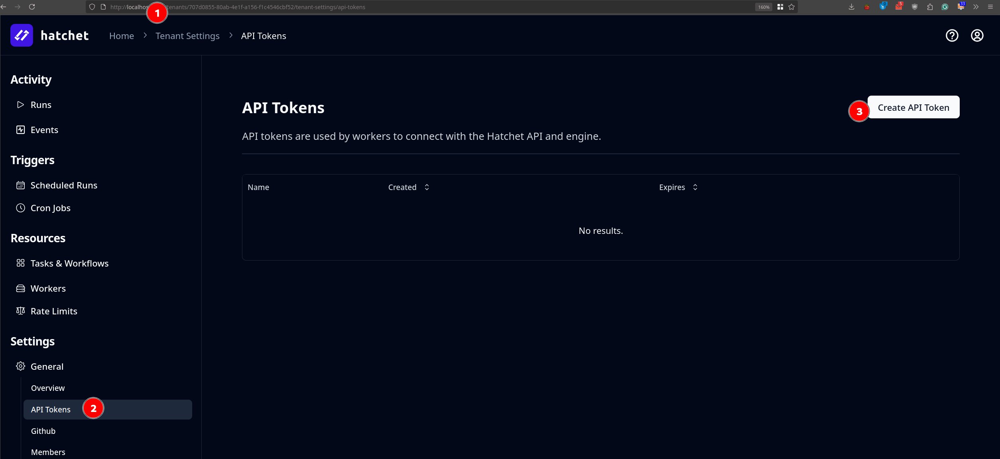

When first deploying to prod, strapi may take a while to start. Like 10 minutes.

# How to run project locally?

Run DB and Hatchet in docker

```
    docker compose -f docker-compose.dev.yml up
```

add to /etc/hosts
```
# Added by Docker Desktop
192.168.10.18 host.docker.internal
192.168.10.18 gateway.docker.internal
# To allow the same kube context to work on the host and the container:
127.0.0.1 kubernetes.docker.internal
# End of section
```

Login to hatchet and get a token to put in /server/.env



Run strapi server 

```
    cd server
    npm i
    npm run dev
```